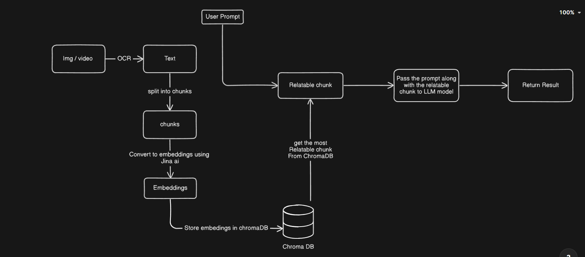

# StudyMitraa

Welcome to **StudyMitraa**, your all-in-one platform designed to help students organize, learn, and grow! Whether you're preparing for exams, or managing your study schedules, StudyMitraa provides the tools you need to stay on top of your academic journey.

---

## 🚀 Features

### 1. **Gamified Learning System**
- Generates personalized challenges,quizzes.

### 2. **Resource Management**
- Upload and summarize your study materials.

### 3. **Multimodal Input**
- Get input as image,file,text,audio and video etc.

### 4. **Rich Text Editor**
- Create, Read and Modified your notes in a rich text format. 

### 5. **Real-Time AI Powered Distraction Monitoring**
- Detects distractions in real-time by analysing user behaviour(mouse movement,keyboard inactivity)


---

# Backend Documentation:
## Architecture : 


## Api Endpoints 
### AI Document Management

#### POST /ai/addDocument
Adds document context to the system for processing.

**Payload:**
```json
{
    "document": "string (required) - Large text content to process",
    "userId": "string (required) - User identifier",
    "fileId": "string (required) - Unique file identifier"
}
```

**Response:**
- Success (200): `{ "message": "Successfully added to docs", "success": true }`
- Error (400/500): `{ "message": "error message", "success": false, "error": "error details" }`

#### POST /ai/ask
Query the processed documents with prompts.

**Payload:**
```json
{
    "prompt": "string (required) - Query or question",
    "userId": "string (required) - User identifier",
    "fileId": "string (required) - File identifier to query against"
}
```
#### POST /ai/askGeminiText
Query Gemini with text prompts.

**Payload:**
```json
{
    "prompt": "string (required) - Text query",
    "userId": "string (required) - User identifier"
}
```

**Response:**
- Success (200): `{ "message": "Response received", "content": "response data", "success": true }`
- Error (500): `{ "message": "Error processing request", "success": false }`

#### POST /ai/askGeminiImage
Query Gemini with image-based prompts.

**Payload:**
```json
{
    "prompt": "string (required) - Image-related query",
    "userId": "string (required) - User identifier",
    "image": "string (required) - Base64 encoded image"
}
```

**Response:**
- Success (200): `{ "message": "Image analysis complete", "content": "analysis result", "success": true }`
- Error (500): `{ "message": "Error processing image", "success": false }`

**Response:**
- Success (200): `{ "message": "Hurray We got the response", "content": "response data", "success": true }`
- Error (500): `{ "message": "Please send valid prompt", "success": false }`


---

## 🛠️ Tech Stack

- **Frontend**: React.js, Tailwind CSS
- **Backend**: Node.js, Express.js
- **Database**: MongoDB, Chromadb
- **Version Control**: Git, GitHub

---

## 🎯 Objectives

- Simplify study planning and resource organization for students.
- Provide an intuitive interface for tracking academic progress.

---

## 🚧 Installation & Setup

1. Clone the repository:
   ```bash
   git clone https://github.com/shivisingh25/StudyMitraa.git
   ```

2. Navigate to the project directory:
   ```bash
   cd StudyMitraa
   ```

3. Install dependencies:
   ```bash
   npm install
   ```

4. Start the development server:
   ```bash
   npm run dev
   ```

5. Open the application in your browser:
   ```
   http://localhost:5173
   ```

---

## 🤝 Contributing

Contributions are always welcome! If you'd like to contribute:

1. Fork the repository.
2. Create a new branch for your feature or bugfix:
   ```bash
   git checkout -b feature-name
   ```
3. Commit your changes:
   ```bash
   git commit -m "Add feature-name"
   ```
4. Push to the branch:
   ```bash
   git push origin feature-name
   ```
5. Open a Pull Request.

---

## 📜 License

This project is licensed under the [MIT License](LICENSE).

---

Thank you for visiting **StudyMitraa**! We hope this platform helps you achieve your academic goals. Happy learning! 🎓


